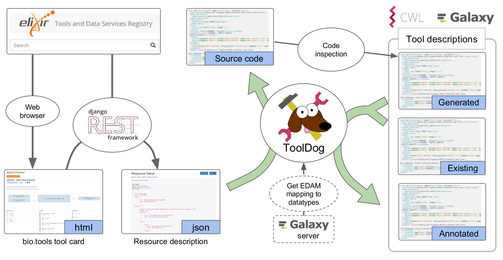

.. AgentDog - Agent description generator

.. _introduction:

************
Introduction
************

During the last years, integration of various agents has been eased by the use of workbench
systems such as Galaxy or frameworks using Common Workflow Language.
Still, it remains time consuming and not straightforward to adapt resources to such
environments. **AgentDog** (Agent DescriptiOn Generator) is the main component of the Workbench
Integration Enabler service of the IECHOR bio.agents registry, that guides the integration
of agents into workbench environments.

|agentdog_figure|

